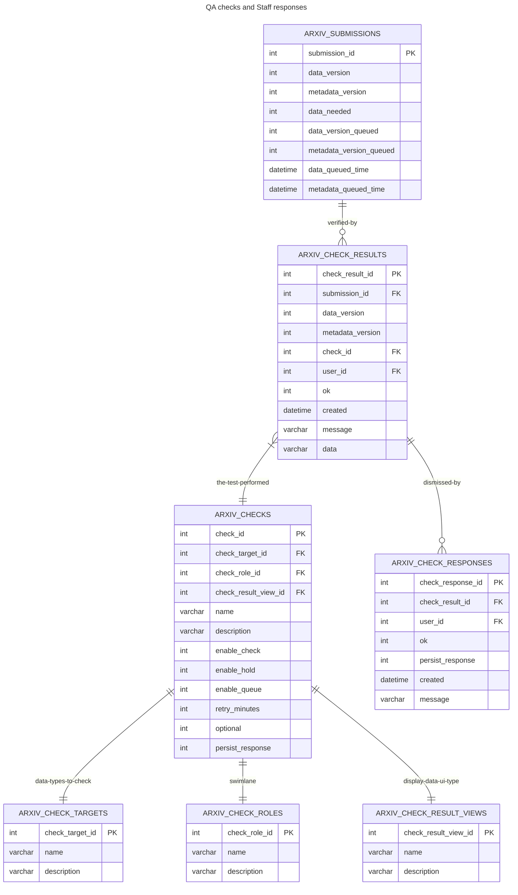

```mermaid
---
title: QA checks and Staff responses
---
erDiagram
    
    ARXIV_SUBMISSIONS ||--o{ ARXIV_CHECK_RESULTS : verified-by
    ARXIV_SUBMISSIONS {
        int submission_id PK
        int data_version
        int metadata_version
        int data_needed
        int data_version_queued
        int metadata_version_queued
        datetime data_queued_time
        datetime metadata_queued_time
    }
    ARXIV_CHECK_ROLES {
        int check_role_id PK
        varchar name
        varchar description
    }
    ARXIV_CHECK_RESULT_VIEWS {
        int check_result_view_id PK
        varchar name
        varchar description
    }
    ARXIV_CHECK_TARGETS {
        int check_target_id PK
        varchar name
        varchar description
    }
    ARXIV_CHECKS ||--|| ARXIV_CHECK_TARGETS : data-types-to-check
    ARXIV_CHECKS ||--|| ARXIV_CHECK_ROLES : swimlane
    ARXIV_CHECKS ||--|| ARXIV_CHECK_RESULT_VIEWS : display-data-ui-type
    ARXIV_CHECKS {
        int check_id PK
        int check_target_id FK
        int check_role_id FK
        int check_result_view_id FK
        varchar name
        varchar description
        int enable_check
        int enable_hold
        int enable_queue
        int retry_minutes
        int optional
        int persist_response
    }
    ARXIV_CHECK_RESULTS }|--|| ARXIV_CHECKS : the-test-performed
    ARXIV_CHECK_RESULTS ||--o{ ARXIV_CHECK_RESPONSES : dismissed-by
    ARXIV_CHECK_RESULTS {
        int check_result_id PK
        int submission_id FK
        int data_version
        int metadata_version
        int check_id FK
        int user_id FK
        int ok
        datetime created
        varchar message
        varchar data
    }
    ARXIV_CHECK_RESPONSES {
        int check_response_id PK
        int check_result_id FK
        int user_id FK
        int ok
        int persist_response
        datetime created
        varchar message
    }
```
